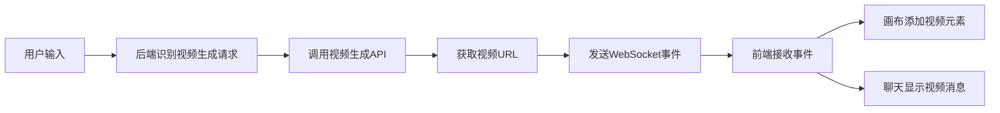

# 视频生成功能优化总结

## 已解决的问题

### 1. WebSocket参数错误 ✅
- **问题**: `send_to_websocket()` 函数调用参数错误（传了3个参数，实际只需要2个）
- **解决**: 修改 `video_handler.py` 中的调用，移除多余的 `canvas_id` 参数

### 2. 前端视频类型识别 ✅
- **问题**: 前端无法识别视频类型的消息
- **解决**:
  - 后端返回的响应增加 `type: 'video'` 字段
  - 创建专门的 `VideoMessage` 组件处理视频消息
  - 修改 `MessageRegular` 组件识别并渲染视频消息

### 3. 嵌入元素链接显示 ✅
- **问题**: 画布上的嵌入元素显示"Empty Web-Embed"
- **解决**:
  - 创建通用的 `EmbedElement` 组件支持多种视频源
  - 修改 `renderEmbeddable` 函数使用新组件
  - CSS隐藏嵌入元素上方的链接

## 优化后的工作流程



## 核心文件变更

### 后端文件
1. **新增** `/server/services/new_chat/video_handler.py`
   - 专门处理视频生成逻辑
   - 不上传到腾讯云，直接返回URL

2. **修改** `/server/services/new_chat/logic_agent.py`
   - 识别视频生成请求
   - 调用视频处理器

### 前端文件
1. **新增** `/react/src/components/chat/VideoMessage.tsx`
   - 视频消息展示组件
   - 支持播放、下载操作

2. **新增** `/react/src/components/canvas/EmbedElement.tsx`
   - 通用嵌入内容组件
   - 支持多种视频平台

3. **修改** `/react/src/components/chat/Message/Regular.tsx`
   - 识别 `type: 'video'` 的消息
   - 使用 `VideoMessage` 组件渲染

4. **修改** `/react/src/components/canvas/CanvasExcali.tsx`
   - 优化 `addVideoEmbed` 函数
   - 使用 `EmbedElement` 组件

## 支持的视频类型

- **直接视频文件**: MP4, WebM, OGG, MOV
- **视频平台**: YouTube, Vimeo, 腾讯视频, Bilibili
- **其他**: 任何可嵌入的iframe链接

## 测试工具

1. **后端测试**: `python test_video_flow.py`
2. **前端测试**: 浏览器控制台加载 `/test-video.js`
3. **完整流程测试**: 执行生成的测试代码

## 示例测试代码

```javascript
// 在画布页面的浏览器控制台执行
const videoUrl = 'https://www.w3schools.com/html/mov_bbb.mp4';
const element = {
  id: `video_${Date.now()}`,
  type: 'embeddable',
  x: 100,
  y: 100,
  width: 640,
  height: 360,
  link: videoUrl,
  // ... 其他属性
};

if (window.excalidrawAPI) {
  const api = window.excalidrawAPI;
  const currentElements = api.getSceneElements();
  api.updateScene({
    elements: [...currentElements, element]
  });
  console.log('✅ 视频已添加到画布');
}
```

## 关键改进

1. **类型标识**: 后端返回 `type: 'video'` 让前端准确识别
2. **错误修复**: WebSocket函数调用参数正确
3. **组件优化**: 创建专门的视频组件提升用户体验
4. **多源支持**: 支持各种主流视频平台
5. **不依赖云存储**: 视频直接使用URL，不上传腾讯云

## 注意事项

- 视频URL必须支持CORS或来自同源
- 大视频文件可能影响加载性能
- 建议限制单个画布的视频数量

## 后续优化建议

- [ ] 添加视频缩略图预览
- [ ] 实现视频进度条控制
- [ ] 支持视频裁剪功能
- [ ] 添加视频加载状态提示
- [ ] 优化视频缓存策略